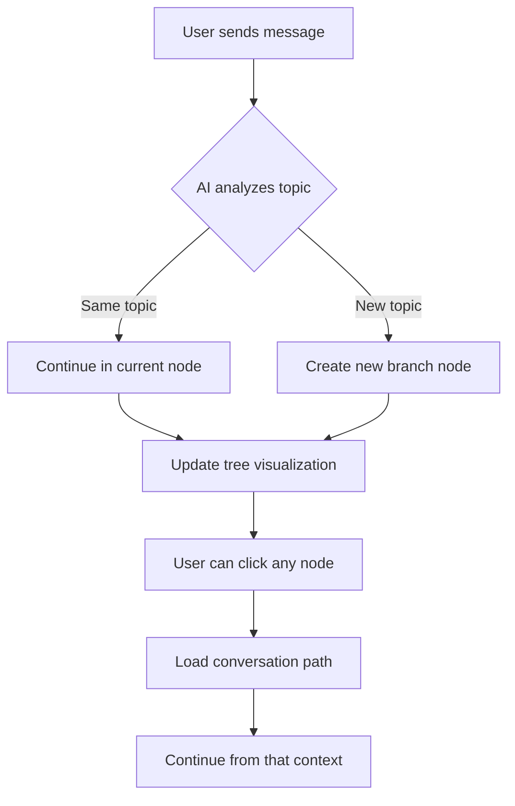

# ThoughtChain

> **Study Without Losing Your Train of Thought**

An AI-powered study assistant that visualizes your learning conversations as an interactive tree of thoughts. Built with Next.js, TypeScript, and Google's Gemini AI.

## The Problem

When studying with AI chatbots:
- One question leads to another
- Topics branch unexpectedly  
- Context keeps piling up
- Soon, the AI remembers everything — even what you don't want it to

**ThoughtChain solves this** by letting you move up or dive deeper into context levels, instead of drowning in one long, messy chat.

## Features

| Feature | Description |
|---------|-------------|
| **AI Study Assistant** | Chat with Gemini 2.5 Flash for exam preparation |
| **Tree Visualization** | See your conversations organized as an interactive mind map |
| **Smart Branching** | AI automatically creates nodes for different topics |
| **Interactive Graph** | Click nodes to view and resume from any conversation point |
| **File Upload** | Share study materials with the AI |
| **Markdown Support** | Rich text formatting with syntax highlighting |
| **Dark Theme** | Easy on the eyes for long study sessions |
| **API Key Modal** | Securely input your own Gemini API key |
| **Responsive Design** | Toggle between chat and graph view on mobile |

## Demo

<!-- Add screenshots or GIFs here -->
```
┌─────────────────────────────────────────────────────────────┐
│  ThoughtChain                              [Get Started]    │
├─────────────────────────────────────────────────────────────┤
│                                                             │
│   ┌─────────┐        ┌─────────────────────────────────┐   │
│   │  Tree   │        │       Chat Messages             │   │
│   │  View   │   ←→   │                                 │   │
│   │         │        │  User: Explain recursion        │   │
│   │   [0]   │        │  Bot: Recursion is...           │   │
│   │    │    │        │                                 │   │
│   │   [1]   │        │  [Type your message...]         │   │
│   └─────────┘        └─────────────────────────────────┘   │
│                                                             │
└─────────────────────────────────────────────────────────────┘
```

## Tech Stack

| Technology | Purpose |
|------------|---------|
| **Next.js 16** | React framework with App Router |
| **TypeScript** | Type-safe development |
| **Tailwind CSS 4** | Utility-first styling |
| **LangChain** | AI orchestration |
| **Google Gemini 2.5 Flash** | Large language model |
| **ReactFlow** | Interactive node-based visualization |
| **Lucide React** | Beautiful icons |

## Getting Started

### Prerequisites

- Node.js 18+ installed
- Google Gemini API key

### Installation

1. Clone the repository:

```bash
git clone <repository-url>
cd ThoughtChain
```

2. Install dependencies:

```bash
npm install
# or
yarn install
# or
pnpm install
```

3. Create a `.env.local` file in the root directory:

```env
GEMINI_API_KEY=your_gemini_api_key_here
```

4. Run the development server:

```bash
npm run dev
# or
yarn dev
# or
pnpm dev
```

5. Open [http://localhost:3000](http://localhost:3000) in your browser

## Project Structure

```
ThoughtChain/
├── src/
│   ├── app/
│   │   ├── api/bot/              # Backend API routes
│   │   │   ├── route.ts          # Main bot endpoint (GET/POST/PUT/DELETE)
│   │   │   ├── bot.ts            # AI logic & tree management
│   │   │   └── response/route.ts # Streaming response endpoint
│   │   ├── chat/                 # Chat interface
│   │   │   └── page.tsx          # Main chat page with tree view
│   │   ├── page.tsx              # Landing page
│   │   ├── globals.css           # Global styles
│   │   └── layout.tsx            # Root layout
│   └── components/
│       ├── ApiKeyModal.tsx       # API key input modal
│       ├── InputBox.tsx          # Message input with file upload
│       ├── MessageBox.tsx        # Individual message display
│       ├── MessageSection.tsx    # Scrollable message container
│       ├── SideBar.tsx           # Navigation sidebar
│       └── TreeFlow.tsx          # ReactFlow mind map visualization
├── package.json
├── tailwind.config.ts
└── tsconfig.json
```

## API Endpoints

| Method | Endpoint | Description |
|--------|----------|-------------|
| `GET` | `/api/bot` | Retrieve the full tree structure |
| `GET` | `/api/bot?pathTo=<nodeId>` | Get conversation path from root to specific node |
| `POST` | `/api/bot` | Send message and receive AI response |
| `PUT` | `/api/bot` | Initialize a new chat session |
| `DELETE` | `/api/bot` | Reset the entire chat tree |
| `POST` | `/api/bot/response` | Streaming response endpoint |

## How It Works



1. **Conversation Flow**: Users chat with the AI about study topics
2. **Node Decision**: AI analyzes each message to decide if a new topic branch should be created
3. **Tree Building**: Messages are organized into nodes with parent-child relationships
4. **Visualization**: ReactFlow renders the tree structure in real-time
5. **Navigation**: Users can click any node to view its conversation path and continue from there

## Key Features Explained

### Automatic Node Creation

The AI uses a specialized prompt to analyze user messages and decide whether to:
- Continue in the current node (same topic)
- Create a new branch for a different topic
- Generate meaningful titles for new nodes

### Path Navigation

Click any node in the tree to:
- Load the complete conversation path from root to that node
- Continue the conversation from that context
- Maintain conversation coherence

### Resizable Layout

- Drag the divider between chat and tree view to adjust your workspace
- On mobile: Toggle between chat and graph views

### Session Management

- Sessions are automatically created and persisted
- Your conversation tree is maintained across page refreshes
- Each session has a unique ID stored in localStorage

## Configuration

### AI Model

The project uses Gemini 2.5 Flash via LangChain. You can modify the model in [src/app/api/bot/bot.ts](src/app/api/bot/bot.ts):

```typescript
const model = new ChatGoogleGenerativeAI({ 
  model: "gemini-2.5-flash",
  apiKey: yourApiKey
});
```

### Styling

Customize the theme in:
- [src/app/globals.css](src/app/globals.css) - Global CSS variables
- Individual component files for component-specific styles

### Environment Variables

| Variable | Description | Required |
|----------|-------------|----------|
| `GEMINI_API_KEY` | Your Google Gemini API key | Yes (or use in-app modal) |

## Learn More

- [Next.js Documentation](https://nextjs.org/docs) - Next.js features and API
- [Google AI SDK](https://ai.google.dev/docs) - Gemini API documentation
- [LangChain.js](https://js.langchain.com/) - AI orchestration framework
- [ReactFlow Documentation](https://reactflow.dev/) - Node-based UI library
- [Tailwind CSS](https://tailwindcss.com/docs) - Utility-first CSS

## Deploy on Vercel

The easiest way to deploy ThoughtChain is using the [Vercel Platform](https://vercel.com/new):

1. Push your code to GitHub
2. Import your repository in Vercel
3. Add your `GEMINI_API_KEY` to environment variables
4. Deploy!

[](https://vercel.com/new/clone?repository-url=https://github.com/YOUR_USERNAME/ThoughtChain)

Check out the [Next.js deployment documentation](https://nextjs.org/docs/app/building-your-application/deploying) for more details.

## Contributing

Contributions are welcome! Here's how you can help:

1. Fork the repository
2. Create a feature branch (`git checkout -b feature/amazing-feature`)
3. Commit your changes (`git commit -m 'Add amazing feature'`)
4. Push to the branch (`git push origin feature/amazing-feature`)
5. Open a Pull Request

## License

MIT License - feel free to use this project for your studies!

---

<p align="center">
  Made for students who want to study smarter, not harder.
</p>
